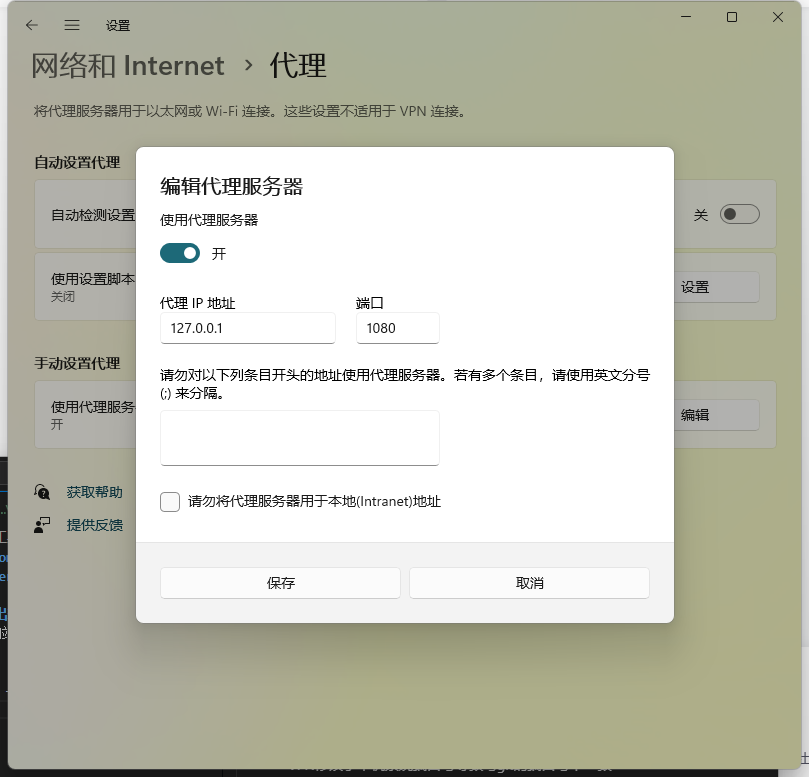

# Failed to connect to github.com port 443 after 21067 ms: Couldn't connect to server

## 一、使用科学上网工具的情况下出现拉取或推送出现该错误
VPN修改了本机系统端口号导致与git的端口号不一致  

### 1、查看本机端口号（win11系统）
> 设置 -> 网络和Internet -> 代理 -> 手动设置代理 -> 编辑
>
> 


### 2、把git端口号设置成上面查看到代理的端口号
我的端口号是1080
```
git config --global http.proxy 127.0.0.1:1080
git config --global https.proxy 127.0.0.1:1080
```
可以使用`git config --global -l`进行查看配置
```
user.name=chenshiai
user.email=xxx@qq.com
http.proxy=127.0.0.1:1080
https.proxy=127.0.0.1:1080
```

## 二、没有使用梯子还是遇到了这个情况
还是因为端口不一致导致的，取消掉git的代理就行
```
git config --global --unset http.proxy
git config --global --unset https.proxy
```