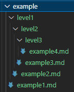
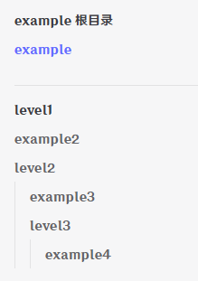

# VitePress 多侧边栏配置方法

在官方的[侧边栏](https://vitepress.dev/zh/reference/default-theme-sidebar#multiple-sidebars)设计中，多侧边栏的配置是使用对象进行定义的，如下所示：

```js
export default {
  themeConfig: {
    sidebar: {
      // 当用户位于 `guide` 目录时，会显示此侧边栏
      '/guide/': [
        {
          text: 'Guide',
          items: [
            { text: 'Index', link: '/guide/' },
            { text: 'One', link: '/guide/one' },
            { text: 'Two', link: '/guide/two' },
          ],
        },
      ],

      // 当用户位于 `config` 目录时，会显示此侧边栏
      '/config/': [
        {
          text: 'Config',
          items: [
            { text: 'Index', link: '/config/' },
            { text: 'Three', link: '/config/three' },
            { text: 'Four', link: '/config/four' },
          ],
        },
      ],
    },
  },
}
```

## 场景模拟
这里有一个三层嵌套的目录  
  
`example`文件夹（文章的根文件夹）下有一个`example1.md`文件，有一个`level1`的子文件夹。  
`level1`里面有一个`example2.md`文件，还有一个子文件夹`level2`。  
`level2`里面有一个`example3.md`文件，还有一个子文件夹`level3`。  
`level3`里面有一个`example4.md`文件。  

如果使用官方的多侧边栏配置方式来给`example`文件夹配置一个侧边栏，那么大概是这样的：
```js
sidebar: {
  '/example': [
    { text: 'example 根目录', items: [{ text: 'example', link: '/example/example1' }] },
    {
      text: 'level1',
      items: [
        { text: 'example2', link: '/example/level1/example2' },
        {
          text: 'level2',
          items: [{ text: 'example3', link: '/example/level1/level2/example3' },
            { 
              text: 'level3',
              items: [{ text: 'example4', link: '/example/level1/level2/level3/example4' }]
            }]
        }]
    }],
},
```
这种给我的观感并不舒适，`text`和`link`这种简单的数据结构出现了多次重复，代码格式也不够紧凑。而且这种结构在文章数量变多后，除了会出现大量且重复的字段，导致整个配置文件变得非常冗长。  
我也尝试使用过各种自动生成侧边栏的工具包，但是均无法满足我的需求——简单、直接，且配置的自由度不受过多影响。
于是决定自己写一个`createPath`方法转换侧边栏配置的方式，使其更符合自己的需求。

下面是使用`createPath`的配置代码：
```js
sidebar: createPath('/example', [
  ['example 根目录', [
    ['example1', '/example1']
  ]],
  ['level1', [
    ['example2', '/level1/example2'],
    ['level2', [
      ['example3', '/level1/level2/example3'],
      ['level3', [
        ['example4', '/level1/level2/level3/example4']
      ]]
    ]]
  ]]
])
```
## createPath 方法
这个方法的目的是为了改变侧边栏配置的方式，但最终输出结果要与原类型保持一致，所以先来看看`vitepress`中`sidebar`的多侧边栏的配置格式：
```ts
sidebar: SidebarItem[] | SidebarMulti

interface SidebarItem {
  text?: string
  link?: string
  items?: SidebarItem[]
  base?: string
  collapsed?: boolean
  docFooterText?: string
  rel?: string
  target?: string
}
// 多侧边栏使用的是下面这个类型
interface SidebarMulti {
  [path: string]: SidebarItem[] | { items: SidebarItem[]; base: string }
}
```
由此可以确定`createPath`方法的返回类型应该为`SidebarMulti`。  
接下来就是决定入参的类型了，入参最终是根据我个人的需求来决定的。在上文可以看见入参是由字符串和多维数组构成的。  
```ts
function createPath(basePath: string, sidebarTree: NodeType[]): SidebarMulti {
  return {
    [basePath]: sidebarTree.map((node: NodeType) => CSI(node, basePath)),
  }
}
```
### 第一个参数 basePath
对应的是`SidebarMulti`中的`[path: string]`，没啥好说的。

### 第二个参数 sidebarTree
sidebarTree的类型是：`NodeType[]`，NodeType 定义如下：
```ts
type NodeType = [string, string | NodeType[] | undefined, SidebarItem?]
```
- NodeType的第一项：string，是标题，对应`SidebarItem`中的`text`。
- NodeType的第二项：string | NodeType[] | undefined，分为三种情况：
  - 如果是string，则表示路径，对应`SidebarItem`中的`link`。
  - 如果是NodeType[]，则表示子目录，对应`SidebarItem`中的`items`。
  - 如果是undefined，则表示既没有`link`，也没有`items`。
- NodeTpye的第三项：SidebarItem，用于自定义当前的目录项，与官方的`SidebarItem`一致。

### CSI方法
> 全称是`createSidebarItem`，偷了个懒，直接用`CSI`代替。  

这个方法的主要作用就是将数组形式的数据转化成`SidebarItem`格式的数据：
```ts
function CSI(node: NodeType, base?: string): SidebarItem {
  let link: SidebarItem['link']
  let customConfig: SidebarItem | {} = {}

  if (typeof node[1] === 'string') {
    link = node[1]
  }
  let items
  if (node[1] instanceof Array) {
    items = node[1].map((item) => CSI(item, base))
    node[2] && (customConfig = node[2])
  }
  return {
    text: node[0],
    link,
    items,
    base,
    ...customConfig,
  }
}
```

最后在页面上的效果如图所示：  

[点击这里查看演示目录](../../../example/example1.md)
